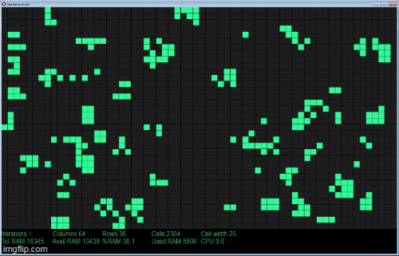

# Game of Life

Game of life shows how very simple rules can create very complex objects in an intuitive way. It was created by [John Horton Conway](https://en.wikipedia.org/wiki/John_Horton_Conway) in the 70s, a rather interesting person.

## Installation

The program needs [pygame](https://www.pygame.org/news) to work, use the package manager [pip](https://pip.pypa.io/en/stable/) to install pygame.

```bash
pip install pygame
```

That's it for python version to get started! However, there's also a cythonized version of this program available. It's a bit tricky to get working depending on you OS.

Here's what I did:

First install Cython with pip
```bash
pip install cython
```

Then go to the path in console: \\...\Game-of-Life-main\GoL_cy_lib

run the command
```bash
python setup.py build_ext --inplace
```
If you're using windows you'll need to install a GCC-compiler.

This should create necessary .pyd-/.so- and .c-files (.pyd for win, .so for linux)

Now you should be able to import and use game_of_life_cy

## Usage

```python
import game_of_life as GOF
import game_of_life_cy as GOF_cy #needs cython

GOF.set_fps(50) # default is 60 FPS
GOF.main() # to start the program

```

Should look something like this when you run the script


To toggle cells alive/dead simply click or drag over them

You can make the window larger/smaller by simply dragging with your mouse

Press arrow key <kbd>Right</kbd> to iterate\
Press <kbd>Space</kbd> toggle run indefinitely\
Press <kbd>Up</kbd>/<kbd>Down</kbd> to increase/decrease the size of the cells

## Authors
Created by Anton Pohlin\
Contact: pohlinanton@gmail.com
## License

[MIT](https://choosealicense.com/licenses/mit/)
